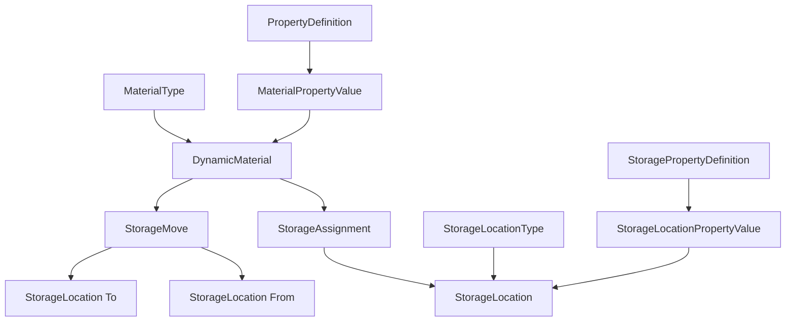

```markdown
# File: docs/storage-domain-documentation.md

# Storage Domain Documentation

**Version:** 1.0  
**Date:** January 2025  
**Status:** Production Ready

---

## 1. Domain Overview

The Storage Domain is a comprehensive storage management system built on the Dynamic Material Management System (DMMS) patterns. It provides flexible, database-driven storage location management with dynamic properties, enabling users to define, customize, and manage physical storage infrastructure without requiring code changes.

### 1.1 Core Capabilities

- **Dynamic Storage Location Types**: Define custom storage categories with dynamic properties
- **Flexible Storage Properties**: Create custom properties for storage locations (material, capacity, locking, etc.)
- **Material-Storage Integration**: Seamless integration with the dynamic material system
- **Intelligent Analytics**: Comprehensive reporting and optimization suggestions
- **Settings Framework**: User-customizable UI and behavior settings
- **Internationalization**: Full multilingual support throughout the system
- **Event-Driven Architecture**: Real-time updates and notifications

### 1.2 Key Features

- **Storage Location Management**: Create and manage physical storage locations
- **Dynamic Properties**: Assign custom properties to different storage types
- **Capacity Tracking**: Monitor utilization and available space
- **Material Assignments**: Track what materials are stored where
- **Movement History**: Complete audit trail of material movements
- **Hierarchical Storage**: Support for parent-child storage relationships
- **Occupancy Analytics**: Detailed reporting and optimization recommendations

## 2. Architecture Overview

### 2.1 Domain Structure

The Storage Domain follows the DMMS layered architecture:

```
┌─────────────────────────────────────────────────────────────┐
│                        API Layer                            │
│  ┌─────────────────┐ ┌─────────────────┐ ┌─────────────────┐ │
│  │   Storage       │ │   Assignment    │ │   Analytics     │ │
│  │   Locations     │ │   Management    │ │   & Reports     │ │
│  └─────────────────┘ └─────────────────┘ └─────────────────┘ │
└─────────────────────────────────────────────────────────────┘
┌─────────────────────────────────────────────────────────────┐
│                      Service Layer                          │
│  ┌─────────────────┐ ┌─────────────────┐ ┌─────────────────┐ │
│  │StorageLocation  │ │StorageLocation  │ │StorageProperty  │ │
│  │    Service      │ │  Type Service   │ │    Service      │ │
│  └─────────────────┘ └─────────────────┘ └─────────────────┘ │
└─────────────────────────────────────────────────────────────┘
┌─────────────────────────────────────────────────────────────┐
│                    Repository Layer                         │
│  ┌─────────────────┐ ┌─────────────────┐ ┌─────────────────┐ │
│  │   Storage       │ │   Assignment    │ │     Move        │ │
│  │  Repository     │ │  Repository     │ │  Repository     │ │
│  └─────────────────┘ └─────────────────┘ └─────────────────┘ │
└─────────────────────────────────────────────────────────────┘
┌─────────────────────────────────────────────────────────────┐
│                       Data Layer                            │
│  ┌─────────────────┐ ┌─────────────────┐ ┌─────────────────┐ │
│  │ StorageLocation │ │StorageAssignment│ │  StorageMove    │ │
│  │     Models      │ │     Models      │ │     Models      │ │
│  └─────────────────┘ └─────────────────┘ └─────────────────┘ │
└─────────────────────────────────────────────────────────────┘
```

### 2.2 Integration with DMMS

The Storage Domain seamlessly integrates with the Dynamic Material Management System:



## 3. Data Models

### 3.1 Core Storage Models

#### StorageLocationType
Defines types of storage with dynamic properties (following MaterialType pattern):

```python
class StorageLocationType(Base, TimestampMixin):
    id = Column(Integer, primary_key=True)
    name = Column(String(100), unique=True, nullable=False)
    icon = Column(String(50))
    color_scheme = Column(String(50))
    ui_config = Column(Text)  # JSON
    storage_config = Column(Text)  # JSON
    visibility_level = Column(String(50), default="all")
    
    # Relationships
    properties = relationship("StorageLocationTypeProperty")
    translations = relationship("StorageLocationTypeTranslation")
    storage_locations = relationship("StorageLocation")
```

#### StorageLocation
Individual storage locations with dynamic properties:

```python
class StorageLocation(Base, ValidationMixin, TimestampMixin):
    id = Column(String(36), primary_key=True)
    storage_location_type_id = Column(Integer, ForeignKey("storage_location_types.id"))
    name = Column(String(100), nullable=False)
    section = Column(String(100))
    description = Column(Text)
    dimensions = Column(Text)  # JSON
    capacity = Column(Integer)
    utilized = Column(Integer, default=0)
    status = Column(String(50), default="ACTIVE")
    
    # Relationships
    storage_location_type = relationship("StorageLocationType")
    property_values = relationship("StorageLocationPropertyValue")
    assignments = relationship("StorageAssignment")
    cells = relationship("StorageCell")
```

#### StorageAssignment
Links materials to storage locations:

```python
class StorageAssignment(Base, ValidationMixin, TimestampMixin):
    id = Column(String(36), primary_key=True)
    material_id = Column(Integer, ForeignKey("dynamic_materials.id"))
    storage_id = Column(String(36), ForeignKey("storage_locations.id"))
    position = Column(Text)  # JSON
    quantity = Column(Float, nullable=False)
    assigned_date = Column(String(50))
    assigned_by = Column(String(100))
    
    # Relationships
    material = relationship("DynamicMaterial")
    location = relationship("StorageLocation")
```

### 3.2 Property System Models

#### StoragePropertyDefinition
Defines custom properties for storage locations:

```python
class StoragePropertyDefinition(Base, TimestampMixin):
    id = Column(Integer, primary_key=True)
    name = Column(String(100), unique=True, nullable=False)
    data_type = Column(String(50), nullable=False)
    group_name = Column(String(100))
    unit = Column(String(50))
    is_required = Column(Boolean, default=False)
    validation_rules = Column(Text)  # JSON
    
    # Relationships
    translations = relationship("StoragePropertyDefinitionTranslation")
    enum_options = relationship("StoragePropertyEnumOption")
```

#### StorageLocationPropertyValue
Stores property values for storage locations:

```python
class StorageLocationPropertyValue(Base):
    storage_location_id = Column(String(36), ForeignKey("storage_locations.id"), primary_key=True)
    property_id = Column(Integer, ForeignKey("storage_property_definitions.id"), primary_key=True)
    
    # Polymorphic storage for different data types
    value_string = Column(Text)
    value_number = Column(Float)
    value_boolean = Column(Boolean)
    value_date = Column(String(50))
    value_enum_id = Column(Integer)
    value_file_id = Column(String(100))
    value_reference_id = Column(Integer)
```

### 3.3 Integration Models

#### StorageCell
Individual cells within storage locations:

```python
class StorageCell(Base, ValidationMixin):
    id = Column(String(36), primary_key=True)
    storage_id = Column(String(36), ForeignKey("storage_locations.id"))
    position = Column(Text)  # JSON: {"row": 1, "column": 2}
    material_id = Column(Integer, ForeignKey("dynamic_materials.id"))
    occupied = Column(Boolean, default=False)
    
    # Relationships
    location = relationship("StorageLocation")
    material = relationship("DynamicMaterial")
```

#### StorageMove
Tracks material movements between locations:

```python
class StorageMove(Base, ValidationMixin, TimestampMixin):
    id = Column(String(36), primary_key=True)
    material_id = Column(Integer, ForeignKey("dynamic_materials.id"))
    from_storage_id = Column(String(36), ForeignKey("storage_locations.id"))
    to_storage_id = Column(String(36), ForeignKey("storage_locations.id"))
    quantity = Column(Float, nullable=False)
    move_date = Column(String(50))
    moved_by = Column(String(100))
    reason = Column(String(255))
    
    # Relationships
    material = relationship("DynamicMaterial")
    from_location = relationship("StorageLocation", foreign_keys=[from_storage_id])
    to_location = relationship("StorageLocation", foreign_keys=[to_storage_id])
```

## 4. Service Layer

### 4.1 StorageLocationService

The main service for managing storage locations, following DMMS patterns:

#### Key Methods

```python
def get_storage_locations(
    self,
    skip: int = 0,
    limit: int = 100,
    storage_location_type_id: Optional[int] = None,
    search: Optional[str] = None,
    status: Optional[str] = None,
    section: Optional[str] = None,
    apply_settings: bool = True,
    **filters
) -> Tuple[List[StorageLocation], int]:
    """Get storage locations with filtering, pagination, and settings."""

def create_storage_location(
    self, 
    data: Dict[str, Any], 
    user_id: Optional[int] = None
) -> StorageLocation:
    """Create a new storage location with dynamic properties."""

def apply_settings_to_locations(
    self, 
    locations: List[StorageLocation], 
    user_id: int
) -> List[StorageLocation]:
    """Apply user UI settings to storage locations."""
```

#### Features

- **Settings Integration**: Applies user preferences for UI display
- **Dynamic Properties**: Handles custom properties per storage type
- **Validation**: Business rule validation and data integrity
- **Event Publishing**: Emits domain events for system integration
- **Cache Management**: Intelligent cache invalidation strategies

### 4.2 StorageLocationTypeService

Manages storage location types with dynamic properties:

#### Key Methods

```python
def create_storage_location_type(
    self, 
    data: Dict[str, Any], 
    created_by: Optional[int] = None
) -> StorageLocationType:
    """Create a new storage location type with properties."""

def create_default_types(self) -> List[StorageLocationType]:
    """Create system default storage location types."""

def assign_property(
    self, 
    type_id: int, 
    property_id: int, 
    assignment_config: Dict[str, Any]
) -> bool:
    """Assign a property to a storage location type."""
```

#### Default Storage Types

The service creates these default storage location types:

| Type | Icon | Features | Default Capacity |
|------|------|----------|------------------|
| Cabinet | cabinet | Supports cells, locking | 24 items |
| Shelf | shelf | Open storage | 12 items |
| Drawer | drawer | Pull-out, supports cells | 12 items |
| Rack | rack | Large scale, supports shelves | 40 items |
| Bin | bin | Small containers | 4 items |

### 4.3 StoragePropertyDefinitionService

Manages custom properties for storage locations:

#### Key Methods

```python
def create_property_definition(
    self, 
    data: Dict[str, Any], 
    created_by: Optional[int] = None
) -> StoragePropertyDefinition:
    """Create a new storage property definition."""

def validate_property_value(self, property_id: int, value: Any) -> bool:
    """Validate a property value against its definition."""

def create_default_properties(self) -> List[StoragePropertyDefinition]:
    """Create system default storage properties."""
```

#### Default Properties

| Property | Type | Group | Description |
|----------|------|-------|-------------|
| material | string | Physical Properties | Primary construction material |
| finish | string | Physical Properties | Surface finish or coating |
| locking | boolean | Security | Whether location has a lock |
| climate_controlled | boolean | Environment | Climate control availability |
| weight_capacity_kg | number | Capacity | Maximum weight capacity |
| access_level | enum | Security | Required access level |
| installation_date | date | Maintenance | Installation date |
| manufacturer | string | Details | Manufacturer name |
| model_number | string | Details | Model/part number |
| fire_rated | boolean | Safety | Fire rating status |

## 5. API Endpoints

### 5.1 Storage Location Type Management

```http
GET    /api/storage/location-types              # List storage location types
POST   /api/storage/location-types              # Create storage location type
GET    /api/storage/location-types/{type_id}    # Get storage location type
PUT    /api/storage/location-types/{type_id}    # Update storage location type
DELETE /api/storage/location-types/{type_id}    # Delete storage location type
```

### 5.2 Storage Location Management

```http
GET    /api/storage/locations                   # List storage locations
POST   /api/storage/locations                   # Create storage location
GET    /api/storage/locations/{location_id}     # Get storage location
PUT    /api/storage/locations/{location_id}     # Update storage location
DELETE /api/storage/locations/{location_id}     # Delete storage location
```

#### Enhanced Filtering

```http
GET /api/storage/locations?storage_location_type_id=1&section=workshop&has_capacity=true&apply_settings=true
```

### 5.3 Storage Cell Management

```http
GET    /api/storage/locations/{location_id}/cells    # List cells in location
POST   /api/storage/locations/{location_id}/cells    # Create cell
```

### 5.4 Storage Assignment Management

```http
GET    /api/storage/assignments                 # List storage assignments
POST   /api/storage/assignments                 # Create assignment
DELETE /api/storage/assignments/{assignment_id} # Delete assignment
```

#### Advanced Filtering

```http
GET /api/storage/assignments?material_id=123&material_type_id=2&location_id=abc-123
```

### 5.5 Storage Move Management

```http
GET    /api/storage/moves                       # List storage moves
POST   /api/storage/moves                       # Create move
```

### 5.6 Analytics and Reports

```http
GET /api/storage/occupancy                      # Storage occupancy report
GET /api/storage/material-types-summary         # Material types in storage
GET /api/storage/analytics/storage-distribution # Distribution analytics
POST /api/storage/sync-utilization             # Sync utilization counts
```

### 5.7 Material-Storage Integration

```http
GET /api/storage/materials/{material_id}/storage-info  # Material storage info
```

#### Response Example

```json
{
  "material_id": 123,
  "stored": true,
  "storage_locations": [
    {
      "location_id": "abc-123",
      "location_name": "Main Workshop Cabinet A1",
      "storage_location_type": {
        "id": 1,
        "name": "cabinet",
        "icon": "cabinet",
        "color_scheme": "brown"
      },
      "section": "MAIN_WORKSHOP",
      "quantity": 5.0,
      "assigned_date": "2025-01-15T10:30:00Z",
      "position": {"row": 1, "column": 2}
    }
  ],
  "total_assigned_quantity": 5.0,
  "storage_locations_count": 1,
  "is_multi_location_stored": false,
  "primary_storage_location": {...},
  "recent_moves": [...]
}
```

### 5.8 Settings Management

```http
GET /api/storage/settings/storage-ui            # Get storage UI settings
PUT /api/storage/settings/storage-ui            # Update storage UI settings
```

## 6. Settings Integration

### 6.1 Storage UI Settings

The storage system supports comprehensive UI customization:

```json
{
  "storage_ui": {
    "card_view": {
      "display_thumbnail": true,
      "max_properties": 4,
      "show_utilization": true
    },
    "list_view": {
      "default_columns": [
        "name", "type", "capacity", "utilized", "section", "status"
      ],
      "show_thumbnail": true
    },
    "grid_view": {
      "show_utilization": true,
      "show_capacity": true,
      "compact_mode": false
    }
  }
}
```

### 6.2 Storage Location Type Settings

```json
{
  "storage_type_ui": {
    "card_view": {
      "display_thumbnail": true,
      "max_properties": 4
    },
    "list_view": {
      "default_columns": [
        "name", "icon", "storage_locations_count", "visibility_level"
      ],
      "show_thumbnail": true
    }
  }
}
```

### 6.3 Settings Application

Settings are automatically applied when `apply_settings=true` (default):

```python
# Service automatically applies user settings
locations, total = service.get_storage_locations(
    skip=0,
    limit=50,
    apply_settings=True  # Applies user's UI preferences
)

# Each location includes ui_settings with applied preferences
for location in locations:
    card_settings = location.ui_settings["card_view"]
    list_settings = location.ui_settings["list_view"]
    theme_info = location.ui_settings["theme"]
```

## 7. Analytics and Reporting

### 7.1 Storage Occupancy Report

Comprehensive analytics on storage utilization:

```json
{
  "total_locations": 15,
  "total_capacity": 240.0,
  "total_utilized": 156.0,
  "utilization_percentage": 65.0,
  "by_type": {
    "cabinet": {
      "capacity": 120.0,
      "utilized": 85.0,
      "locations": 5,
      "utilization_percentage": 70.8
    }
  },
  "by_section": {
    "MAIN_WORKSHOP": {
      "capacity": 96.0,
      "utilized": 78.0,
      "locations": 4,
      "utilization_percentage": 81.3
    }
  },
  "items_by_type": {
    "leather": {
      "unique_materials": 15,
      "total_quantity": 45.5
    }
  },
  "most_utilized_locations": [...],
  "least_utilized_locations": [...],
  "recommendations": [
    "Overall utilization is moderate. Monitor high-usage locations for capacity expansion."
  ]
}
```

### 7.2 Distribution Analytics

Advanced analytics on material distribution:

```http
GET /api/storage/analytics/storage-distribution?storage_location_type_id=1&section=workshop
```

```json
{
  "total_locations": 10,
  "locations_with_assignments": 8,
  "locations_without_assignments": 2,
  "multi_material_locations": 5,
  "distribution_by_type": {...},
  "distribution_by_section": {...},
  "capacity_efficiency": 78.5,
  "space_utilization_score": 80.0,
  "top_storage_locations": [...],
  "locations_needing_attention": [...]
}
```

### 7.3 Material Type Summary

Summary of materials currently in storage:

```json
{
  "success": true,
  "material_types": {
    "leather": {
      "material_type_id": 1,
      "material_type_name": "Leather",
      "unique_materials": 15,
      "total_quantity": 45.5
    }
  },
  "total_types": 3
}
```

## 8. Event System

### 8.1 Domain Events

The storage system emits domain events for integration:

#### Storage Location Events

```python
# Storage location created
{
  "type": "storage_location.created",
  "storage_location_id": "abc-123",
  "name": "Workshop Cabinet A1",
  "storage_location_type_id": 1,
  "created_by": 42,
  "timestamp": "2025-01-15T10:30:00Z"
}

# Storage location updated
{
  "type": "storage_location.updated",
  "storage_location_id": "abc-123",
  "updated_by": 42,
  "timestamp": "2025-01-15T11:15:00Z"
}
```

#### Assignment Events

```python
# Material assigned to storage
{
  "type": "storage_assignment.created",
  "assignment_id": "def-456",
  "material_id": 123,
  "storage_location_id": "abc-123",
  "quantity": 5.0,
  "assigned_by": 42,
  "timestamp": "2025-01-15T14:20:00Z"
}
```

#### Movement Events

```python
# Material moved between locations
{
  "type": "storage_move.created",
  "move_id": "ghi-789",
  "material_id": 123,
  "from_storage_id": "abc-123",
  "to_storage_id": "xyz-789",
  "quantity": 2.0,
  "moved_by": 42,
  "timestamp": "2025-01-15T16:45:00Z"
}
```

### 8.2 Event Handlers

Example event handler for inventory synchronization:

```python
@event_handler("storage_assignment.created")
def sync_inventory_on_assignment(event):
    """Update material inventory when assigned to storage."""
    material_id = event.material_id
    quantity = event.quantity
    
    # Update material location
    material_service.update_storage_location(
        material_id, 
        event.storage_location_id
    )
    
    # Log inventory movement
    inventory_service.log_movement(
        material_id=material_id,
        movement_type="STORAGE_ASSIGNMENT",
        quantity=quantity,
        location=event.storage_location_id,
        user_id=event.assigned_by
    )
```

## 9. Integration Patterns

### 9.1 Material-Storage Bidirectional Integration

The storage system provides seamless integration with the material system:

#### Material Model Extensions

```python
class DynamicMaterial(Base, TimestampMixin):
    # ... existing fields ...
    
    # Storage relationships
    storage_cells = relationship("StorageCell", back_populates="material")
    storage_assignments = relationship("StorageAssignment", back_populates="material")
    storage_moves = relationship("StorageMove", back_populates="material")
    
    # Storage hybrid properties
    @hybrid_property
    def current_storage_locations(self):
        """Get all current storage locations for this material."""
        return [assignment.location for assignment in self.storage_assignments]
    
    @hybrid_property
    def total_assigned_quantity(self):
        """Get total quantity assigned to storage locations."""
        return sum(assignment.quantity for assignment in self.storage_assignments)
    
    @hybrid_property
    def is_multi_location_stored(self):
        """Check if material is stored in multiple locations."""
        return len(set(a.storage_id for a in self.storage_assignments)) > 1
```

#### Enhanced Material API Responses

When `include_storage=true`, material endpoints include storage information:

```json
{
  "id": 123,
  "name": "Premium Leather Hide",
  "storage_info": {
    "is_stored": true,
    "storage_locations_count": 2,
    "total_assigned_quantity": 8.5,
    "primary_location": {
      "id": "abc-123",
      "name": "Main Workshop Cabinet A1",
      "section": "MAIN_WORKSHOP"
    },
    "all_locations": [...]
  }
}
```

### 9.2 Workflow Integration

#### Typical Material Storage Workflow

1. **Material Creation**: Material is created in the system
2. **Storage Assignment**: Material is assigned to a storage location
3. **Capacity Update**: Storage location utilization is updated
4. **Event Publishing**: Assignment event is published
5. **Inventory Sync**: Material's storage location is updated
6. **Analytics Update**: Storage analytics are recalculated

#### Material Movement Workflow

1. **Move Request**: User initiates material move
2. **Validation**: System validates source has sufficient quantity
3. **Move Creation**: StorageMove record is created
4. **Assignment Update**: Source/destination assignments are updated
5. **Location Update**: Storage location utilization is updated
6. **Event Publishing**: Move event is published
7. **Audit Trail**: Movement is logged for audit purposes

## 10. Configuration and Setup

### 10.1 Initial System Setup

#### 1. Create Default Storage Location Types

```python
# Create default storage location types
storage_type_service = StorageLocationTypeService(session)
default_types = storage_type_service.create_default_types()
```

#### 2. Create Default Storage Properties

```python
# Create default storage properties
property_service = StoragePropertyDefinitionService(session)
default_properties = property_service.create_default_properties()
```

#### 3. Assign Properties to Types

```python
# Example: Assign "locking" property to cabinet type
cabinet_type = storage_type_service.get_type_by_name("cabinet")
locking_property = property_service.get_property_by_name("locking")

storage_type_service.assign_property(
    type_id=cabinet_type.id,
    property_id=locking_property.id,
    assignment_config={
        "is_required": False,
        "is_displayed_in_card": True,
        "display_order": 1,
        "default_value": True
    }
)
```

### 10.2 Custom Storage Location Type Creation

#### Example: Create Custom "Tool Chest" Type

```python
tool_chest_data = {
    "name": "tool_chest",
    "icon": "tool-chest",
    "color_scheme": "red",
    "visibility_level": "all",
    "ui_config": {
        "default_dimensions": {"width": 6, "height": 4, "depth": 3},
        "supports_cells": True,
        "supports_locking": True
    },
    "storage_config": {
        "default_capacity": 20,
        "capacity_unit": "tools",
        "weight_limit_kg": 50
    },
    "translations": {
        "en": {
            "display_name": "Tool Chest",
            "description": "Mobile tool storage chest"
        }
    },
    "properties": [
        {
            "property_id": locking_property.id,
            "display_order": 1,
            "is_required": True,
            "default_value": True
        },
        {
            "property_id": weight_capacity_property.id,
            "display_order": 2,
            "is_required": False,
            "default_value": 50
        }
    ]
}

tool_chest_type = storage_type_service.create_storage_location_type(
    tool_chest_data, 
    created_by=user.id
)
```

### 10.3 Custom Property Creation

#### Example: Create "Temperature Range" Property

```python
temp_property_data = {
    "name": "temperature_range",
    "data_type": "enum",
    "group_name": "Environment",
    "unit": "°C",
    "validation_rules": {
        "required_for_climate_controlled": True
    },
    "enum_options": [
        {"value": "frozen", "display_value": "Frozen (-18°C to -10°C)"},
        {"value": "refrigerated", "display_value": "Refrigerated (2°C to 8°C)"},
        {"value": "cool", "display_value": "Cool (10°C to 15°C)"},
        {"value": "room", "display_value": "Room Temperature (18°C to 25°C)"},
        {"value": "warm", "display_value": "Warm (25°C to 35°C)"}
    ],
    "translations": {
        "en": {
            "display_name": "Temperature Range",
            "description": "Optimal temperature range for stored materials"
        }
    }
}

temp_property = property_service.create_property_definition(
    temp_property_data,
    created_by=user.id
)
```

## 11. Usage Examples

### 11.1 Creating a Complete Storage Setup

#### 1. Create Workshop Storage

```python
# Create main workshop cabinet
cabinet_data = {
    "storage_location_type_id": cabinet_type.id,
    "name": "Main Workshop Cabinet A1",
    "section": "MAIN_WORKSHOP",
    "description": "Primary leather storage cabinet",
    "dimensions": {"width": 4, "height": 6, "depth": 2},
    "capacity": 24,
    "status": "ACTIVE",
    "property_values": [
        {
            "property_id": locking_property.id,
            "value": True
        },
        {
            "property_id": material_property.id,
            "value": "Oak Wood"
        },
        {
            "property_id": access_level_property.id,
            "value": "restricted"
        }
    ],
    "translations": {
        "en": "Main Workshop Cabinet A1",
        "es": "Gabinete Principal del Taller A1"
    }
}

cabinet = storage_service.create_storage_location(cabinet_data, user.id)
```

#### 2. Assign Materials to Storage

```python
# Assign leather hide to cabinet
assignment_data = {
    "material_id": leather_hide.id,
    "storage_id": cabinet.id,
    "position": {"row": 1, "column": 2, "shelf": "top"},
    "quantity": 3.5,
    "notes": "Premium vegetable-tanned leather"
}

assignment = storage_service.create_storage_assignment(assignment_data, user.id)
```

#### 3. Move Materials Between Locations

```python
# Move some leather to secondary storage
move_data = {
    "material_id": leather_hide.id,
    "from_storage_id": cabinet.id,
    "to_storage_id": secondary_cabinet.id,
    "quantity": 1.0,
    "reason": "Reorganization for better accessibility",
    "notes": "Moving less frequently used pieces"
}

move = storage_service.create_storage_move(move_data, user.id)
```

### 11.2 Analytics and Reporting Usage

#### 1. Generate Occupancy Report

```python
# Get comprehensive occupancy report
report = storage_service.get_storage_occupancy_report(
    section="MAIN_WORKSHOP",
    storage_location_type_id=cabinet_type.id
)

print(f"Workshop Cabinet Utilization: {report['utilization_percentage']}%")
print(f"Locations at capacity: {report['locations_at_capacity']}")

for recommendation in report['recommendations']:
    print(f"Recommendation: {recommendation}")
```

#### 2. Analyze Material Distribution

```python
# Get distribution analytics
analytics = requests.get(
    "/api/storage/analytics/storage-distribution",
    params={"section": "MAIN_WORKSHOP"}
).json()

print(f"Space utilization score: {analytics['space_utilization_score']}%")
print(f"Locations needing attention: {len(analytics['locations_needing_attention'])}")
```

#### 3. Monitor Material Storage

```python
# Check where a specific material is stored
storage_info = requests.get(
    f"/api/storage/materials/{leather_hide.id}/storage-info"
).json()

if storage_info['stored']:
    print(f"Material stored in {storage_info['storage_locations_count']} locations")
    print(f"Total quantity assigned: {storage_info['total_assigned_quantity']}")
    
    primary_location = storage_info['primary_storage_location']
    print(f"Primary location: {primary_location['location_name']}")
```

### 11.3 Settings Customization

#### 1. Customize Storage UI Settings

```python
# Update user's storage UI preferences
ui_settings = {
    "card_view": {
        "display_thumbnail": True,
        "max_properties": 6,
        "show_utilization": True
    },
    "list_view": {
        "default_columns": [
            "name", "type", "section", "capacity", 
            "utilized", "utilization_percentage", "status"
        ],
        "show_thumbnail": False
    },
    "grid_view": {
        "show_utilization": True,
        "show_capacity": True,
        "compact_mode": True
    }
}

requests.put(
    "/api/storage/settings/storage-ui",
    json=ui_settings
)
```

#### 2. Apply Settings to Responses

```python
# Get storage locations with applied settings
response = requests.get(
    "/api/storage/locations",
    params={"apply_settings": True}
)

locations = response.json()['items']

for location in locations:
    # UI settings are automatically applied
    card_settings = location.get('ui_settings', {}).get('card_view', {})
    max_props = card_settings.get('max_properties', 4)
    theme = location.get('ui_settings', {}).get('theme', {})
```

## 12. Performance Considerations

### 12.1 Database Optimization

#### Indexes

The storage system includes optimized indexes for common queries:

```sql
-- Storage location indexes
CREATE INDEX idx_storage_locations_type_id ON storage_locations(storage_location_type_id);
CREATE INDEX idx_storage_locations_section ON storage_locations(section);
CREATE INDEX idx_storage_locations_status ON storage_locations(status);
CREATE INDEX idx_storage_locations_name ON storage_locations(name);

-- Assignment indexes
CREATE INDEX idx_storage_assignments_material_id ON storage_assignments(material_id);
CREATE INDEX idx_storage_assignments_storage_id ON storage_assignments(storage_id);
CREATE INDEX idx_storage_assignments_assigned_date ON storage_assignments(assigned_date);

-- Move indexes
CREATE INDEX idx_storage_moves_material_id ON storage_moves(material_id);
CREATE INDEX idx_storage_moves_from_storage_id ON storage_moves(from_storage_id);
CREATE INDEX idx_storage_moves_to_storage_id ON storage_moves(to_storage_id);
CREATE INDEX idx_storage_moves_move_date ON storage_moves(move_date);
```

#### Query Optimization

```python
# Use eager loading to avoid N+1 queries
query = query.options(
    joinedload(StorageLocation.storage_location_type),
    joinedload(StorageLocation.property_values).joinedload(StorageLocationPropertyValue.property),
    joinedload(StorageLocation.assignments).joinedload(StorageAssignment.material)
)

# Use relationship loading for assignments
assignments = assignment_repository.get_assignments_by_material_type(
    material_type_id, skip=skip, limit=limit
)
```

### 12.2 Caching Strategy

#### Cache Keys and TTL

```python
# Location cache
cache_key = f"storage_locations:{hash(params)}"
ttl = 300  # 5 minutes

# Type cache
cache_key = f"storage_location_types:{type_id}"
ttl = 3600  # 1 hour

# Analytics cache
cache_key = f"storage_occupancy:{section}:{type_id}"
ttl = 900  # 15 minutes
```

#### Cache Invalidation

```python
# Invalidate on storage location changes
if self.cache_service:
    self.cache_service.invalidate(f"storage_locations:{location_id}")
    self.cache_service.invalidate_pattern("storage_locations:*")
    self.cache_service.invalidate_pattern("storage_occupancy:*")
```

### 12.3 Pagination Best Practices

#### Efficient Pagination

```python
# Use appropriate limits
MAX_RESULTS = 500
actual_limit = min(limit, MAX_RESULTS)

# Count optimization for large datasets
try:
    total = service.get_storage_locations_count(**filters)
except Exception:
    # Fallback for complex queries
    total = len(all_results)
```

#### Progressive Loading

```python
# Load basic data first
locations = service.get_storage_locations(
    skip=skip, 
    limit=limit, 
    include_assignments=False
)

# Load detailed data on demand
if include_detailed_info:
    for location in locations:
        location.assignments = service.get_assignments_by_storage(location.id)
```

## 13. Security Considerations

### 13.1 Access Control

#### Role-Based Permissions

```python
# Storage location access
@require_permission("storage.location.view")
def list_storage_locations():
    pass

@require_permission("storage.location.create")
def create_storage_location():
    pass

@require_permission("storage.location.admin")
def delete_storage_location():
    pass
```

#### Data Filtering by Access Level

```python
# Filter locations by user access level
def get_accessible_locations(user):
    if user.is_admin:
        return query  # All locations
    elif user.has_permission("storage.restricted"):
        return query.filter(
            StorageLocation.access_level.in_(["public", "restricted"])
        )
    else:
        return query.filter(StorageLocation.access_level == "public")
```

### 13.2 Data Validation

#### Input Sanitization

```python
@validates("name")
def validate_name(self, key: str, name: str) -> str:
    if not name or len(name.strip()) < 2:
        raise ValueError("Storage location name must be at least 2 characters")
    return name.strip()

@validates("capacity")
def validate_capacity(self, key: str, capacity: int) -> int:
    if capacity < 0:
        raise ValueError("Capacity cannot be negative")
    if capacity > 10000:
        raise ValueError("Capacity cannot exceed 10,000 items")
    return capacity
```

#### Business Rule Validation

```python
def validate_storage_assignment(assignment_data):
    """Validate storage assignment business rules."""
    # Check capacity constraints
    location = get_storage_location(assignment_data["storage_id"])
    if location.available_capacity < assignment_data["quantity"]:
        raise ValidationException("Insufficient storage capacity")
    
    # Check access permissions
    if location.access_level == "admin" and not user.is_admin:
        raise PermissionException("Admin access required for this location")
    
    # Validate material compatibility
    material = get_material(assignment_data["material_id"])
    if not is_compatible(material, location):
        raise ValidationException("Material not compatible with storage location")
```

### 13.3 Audit Trail

#### Change Tracking

```python
# All operations are logged with user context
{
  "action": "storage_location.created",
  "user_id": 42,
  "user_email": "john@example.com",
  "resource_id": "abc-123",
  "resource_type": "storage_location",
  "changes": {
    "name": "Workshop Cabinet A1",
    "storage_location_type_id": 1,
    "capacity": 24
  },
  "ip_address": "192.168.1.100",
  "user_agent": "Mozilla/5.0...",
  "timestamp": "2025-01-15T10:30:00Z"
}
```

## 14. Testing

### 14.1 Unit Testing

#### Service Testing

```python
class TestStorageLocationService:
    def test_create_storage_location_with_properties(self):
        """Test creating storage location with custom properties."""
        data = {
            "storage_location_type_id": self.cabinet_type.id,
            "name": "Test Cabinet",
            "capacity": 20,
            "property_values": [
                {"property_id": self.locking_property.id, "value": True},
                {"property_id": self.material_property.id, "value": "Steel"}
            ]
        }
        
        location = self.service.create_storage_location(data, self.user.id)
        
        assert location.name == "Test Cabinet"
        assert location.capacity == 20
        assert len(location.property_values) == 2
    
    def test_apply_settings_to_locations(self):
        """Test applying user settings to storage locations."""
        # Setup user settings
        self.settings_service.set_setting(
            "storage_ui", 
            {"card_view": {"max_properties": 6}}, 
            "user", 
            str(self.user.id)
        )
        
        locations = [self.test_location]
        result = self.service.apply_settings_to_locations(locations, self.user.id)
        
        assert result[0].ui_settings["card_view"]["max_properties"] == 6
```

#### Repository Testing

```python
class TestStorageLocationRepository:
    def test_list_with_properties_filtering(self):
        """Test listing locations with property-based filtering."""
        locations, total = self.repository.list_with_properties(
            storage_location_type_id=self.cabinet_type.id,
            search="workshop",
            section="MAIN_WORKSHOP"
        )
        
        assert total > 0
        assert all(loc.storage_location_type_id == self.cabinet_type.id for loc in locations)
        assert all("workshop" in loc.name.lower() for loc in locations)
```

### 14.2 Integration Testing

#### API Testing

```python
class TestStorageLocationAPI:
    def test_create_location_with_settings(self):
        """Test creating location and applying settings in response."""
        # Create location
        response = self.client.post("/api/storage/locations", json={
            "storage_location_type_id": 1,
            "name": "Test Location",
            "capacity": 15
        })
        
        assert response.status_code == 201
        location = response.json()
        
        # Verify settings were applied
        response = self.client.get(
            f"/api/storage/locations/{location['id']}",
            params={"apply_settings": True}
        )
        
        location_with_settings = response.json()
        assert "ui_settings" in location_with_settings
    
    def test_occupancy_report_generation(self):
        """Test comprehensive occupancy report generation."""
        response = self.client.get("/api/storage/occupancy")
        
        assert response.status_code == 200
        report = response.json()
        
        required_fields = [
            "total_locations", "total_capacity", "total_utilized",
            "utilization_percentage", "by_type", "by_section",
            "recommendations"
        ]
        
        for field in required_fields:
            assert field in report
```

### 14.3 Performance Testing

#### Load Testing

```python
def test_location_list_performance():
    """Test performance of location listing with large datasets."""
    # Create 1000 test locations
    create_test_locations(1000)
    
    start_time = time.time()
    
    response = client.get("/api/storage/locations", params={
        "limit": 100,
        "apply_settings": True
    })
    
    end_time = time.time()
    duration = end_time - start_time
    
    assert response.status_code == 200
    assert duration < 2.0  # Should complete within 2 seconds
    assert len(response.json()["items"]) == 100

def test_analytics_performance():
    """Test performance of analytics generation."""
    # Create test data
    create_test_storage_hierarchy(100, 1000)  # 100 locations, 1000 assignments
    
    start_time = time.time()
    
    response = client.get("/api/storage/occupancy")
    
    duration = time.time() - start_time
    
    assert response.status_code == 200
    assert duration < 5.0  # Analytics should complete within 5 seconds
```

## 15. Troubleshooting

### 15.1 Common Issues

#### Storage Location Creation Issues

| Issue | Symptoms | Solution |
|-------|----------|----------|
| Duplicate name error | "Storage location with name 'X' already exists" | Use unique names within each section |
| Property validation fails | "Invalid value for property 'Y'" | Check property data type and validation rules |
| Type not found | "Storage location type with ID X not found" | Verify type exists and user has access |
| Permission denied | "Access denied" | Check user permissions for storage.location.create |

#### Assignment Issues

| Issue | Symptoms | Solution |
|-------|----------|----------|
| Capacity exceeded | "Storage location capacity exceeded" | Check available capacity before assignment |
| Material not found | "Material with ID X not found" | Verify material exists and is accessible |
| Invalid position | Position validation errors | Ensure position matches location's cell structure |
| Duplicate assignment | Material already assigned to location | Check existing assignments first |

#### Performance Issues

| Issue | Symptoms | Solution |
|-------|----------|----------|
| Slow location listing | API timeouts or slow responses | Add pagination, check indexes, enable caching |
| Analytics timeout | Report generation fails | Reduce data scope, optimize queries |
| Memory usage high | Server memory exhaustion | Implement pagination, optimize eager loading |

### 15.2 Debugging Tools

#### Debug Logging

```python
# Enable debug logging for storage operations
import logging

logging.getLogger("app.services.storage_location_service").setLevel(logging.DEBUG)
logging.getLogger("app.repositories.storage_repository").setLevel(logging.DEBUG)

# Log SQL queries
logging.getLogger("sqlalchemy.engine").setLevel(logging.INFO)
```

#### Health Check Endpoint

```http
GET /api/storage/system/health
```

```json
{
  "success": true,
  "message": "Storage system is healthy",
  "data": {
    "storage_service": "operational",
    "database_connection": "active",
    "locations_accessible": true,
    "assignments_accessible": true,
    "total_locations": 15,
    "dynamic_types_supported": true,
    "settings_integration": true,
    "timestamp": "2025-01-15T10:30:00Z"
  }
}
```

#### Performance Monitoring

```python
# Monitor API performance
@monitor_performance
def list_storage_locations():
    start_time = time.time()
    result = service.get_storage_locations(...)
    duration = time.time() - start_time
    
    metrics.record("api.storage.locations.duration", duration)
    metrics.record("api.storage.locations.count", len(result[0]))
    
    return result
```

### 15.3 Data Integrity Checks

#### Utilization Sync Verification

```python
# Verify storage utilization counts
def verify_utilization_integrity():
    """Check that storage utilization counts match actual assignments."""
    locations = storage_service.get_storage_locations(skip=0, limit=10000)
    
    discrepancies = []
    
    for location in locations:
        actual_assignments = len(location.assignments)
        recorded_utilized = location.utilized
        
        if actual_assignments != recorded_utilized:
            discrepancies.append({
                "location_id": location.id,
                "location_name": location.name,
                "recorded_utilized": recorded_utilized,
                "actual_assignments": actual_assignments,
                "difference": actual_assignments - recorded_utilized
            })
    
    return discrepancies

# Auto-fix utilization discrepancies
def fix_utilization_discrepancies():
    """Automatically fix utilization count discrepancies."""
    result = storage_service.update_storage_utilization_from_assignments()
    return result
```

#### Orphaned Record Detection

```python
def find_orphaned_assignments():
    """Find assignments referencing non-existent materials or locations."""
    orphaned = []
    
    assignments = assignment_repository.list()
    
    for assignment in assignments:
        # Check material exists
        if not material_repository.get_by_id(assignment.material_id):
            orphaned.append({
                "type": "material",
                "assignment_id": assignment.id,
                "missing_id": assignment.material_id
            })
        
        # Check location exists
        if not location_repository.get_by_id(assignment.storage_id):
            orphaned.append({
                "type": "location", 
                "assignment_id": assignment.id,
                "missing_id": assignment.storage_id
            })
    
    return orphaned
```

## 16. Migration and Deployment

### 16.1 Database Migration

#### Initial Schema Creation

```sql
-- Create storage location types table
CREATE TABLE storage_location_types (
    id INTEGER PRIMARY KEY AUTOINCREMENT,
    name VARCHAR(100) NOT NULL UNIQUE,
    icon VARCHAR(50),
    color_scheme VARCHAR(50),
    ui_config TEXT,
    storage_config TEXT,
    created_by INTEGER,
    is_system BOOLEAN DEFAULT FALSE,
    visibility_level VARCHAR(50) DEFAULT 'all',
    created_at DATETIME DEFAULT CURRENT_TIMESTAMP,
    updated_at DATETIME DEFAULT CURRENT_TIMESTAMP
);

-- Create storage locations table
CREATE TABLE storage_locations (
    id VARCHAR(36) PRIMARY KEY,
    storage_location_type_id INTEGER NOT NULL,
    name VARCHAR(100) NOT NULL,
    section VARCHAR(100),
    description TEXT,
    dimensions TEXT,
    capacity INTEGER,
    utilized INTEGER DEFAULT 0,
    status VARCHAR(50) DEFAULT 'ACTIVE',
    notes TEXT,
    parent_storage_id VARCHAR(36),
    created_by INTEGER,
    ui_config TEXT,
    storage_config TEXT,
    last_modified VARCHAR(50),
    created_at DATETIME DEFAULT CURRENT_TIMESTAMP,
    updated_at DATETIME DEFAULT CURRENT_TIMESTAMP,
    FOREIGN KEY (storage_location_type_id) REFERENCES storage_location_types(id),
    FOREIGN KEY (parent_storage_id) REFERENCES storage_locations(id)
);

-- Create other tables...
```

#### Data Migration from Legacy System

```python
def migrate_legacy_storage_data():
    """Migrate from old hardcoded storage system to dynamic system."""
    
    # 1. Create storage location types from legacy enum values
    legacy_types = ["CABINET", "SHELF", "DRAWER", "RACK", "BIN"]
    type_mapping = {}
    
    for legacy_type in legacy_types:
        type_data = {
            "name": legacy_type.lower(),
            "icon": legacy_type.lower(),
            "color_scheme": get_default_color_scheme(legacy_type),
            "is_system": True,
            "visibility_level": "all"
        }
        
        new_type = storage_type_service.create_storage_location_type(type_data)
        type_mapping[legacy_type] = new_type.id
    
    # 2. Migrate existing storage locations
    legacy_locations = session.query(LegacyStorageLocation).all()
    
    for legacy_location in legacy_locations:
        location_data = {
            "storage_location_type_id": type_mapping[legacy_location.type],
            "name": legacy_location.name,
            "section": legacy_location.section,
            "description": legacy_location.description,
            "capacity": legacy_location.capacity,
            "utilized": legacy_location.utilized,
            "status": legacy_location.status
        }
        
        new_location = storage_service.create_storage_location(location_data)
        
        # Migrate assignments
        for assignment in legacy_location.assignments:
            assignment_data = {
                "material_id": assignment.material_id,
                "storage_id": new_location.id,
                "quantity": assignment.quantity,
                "assigned_date": assignment.assigned_date,
                "assigned_by": assignment.assigned_by
            }
            
            storage_service.create_storage_assignment(assignment_data)
```

### 16.2 Deployment Checklist

#### Pre-Deployment

- [ ] Database schema migrations completed
- [ ] Default storage location types created
- [ ] Default storage properties created
- [ ] Legacy data migration completed (if applicable)
- [ ] Indexes created for performance
- [ ] Cache system configured
- [ ] Event bus integration tested
- [ ] API endpoints tested
- [ ] Authentication/authorization configured

#### Post-Deployment

- [ ] System health check passed
- [ ] Storage utilization sync completed
- [ ] Analytics generation tested
- [ ] User settings defaults applied
- [ ] Event publishing verified
- [ ] Performance monitoring enabled
- [ ] Error logging configured
- [ ] Backup strategy implemented

### 16.3 Rollback Strategy

#### Safe Rollback Procedure

1. **Stop new writes** to storage system
2. **Export current data** for recovery
3. **Restore database** to previous version
4. **Restart services** with previous code version
5. **Verify system integrity** after rollback
6. **Resume normal operations**

```python
def create_rollback_backup():
    """Create complete backup for rollback purposes."""
    backup_data = {
        "storage_location_types": export_storage_location_types(),
        "storage_locations": export_storage_locations(),
        "storage_assignments": export_storage_assignments(),
        "storage_moves": export_storage_moves(),
        "property_definitions": export_property_definitions(),
        "settings": export_storage_settings(),
        "timestamp": datetime.now().isoformat(),
        "version": get_system_version()
    }
    
    backup_file = f"storage_backup_{datetime.now().strftime('%Y%m%d_%H%M%S')}.json"
    
    with open(backup_file, 'w') as f:
        json.dump(backup_data, f, indent=2)
    
    return backup_file
```

## 17. Best Practices

### 17.1 Storage Organization

#### Naming Conventions

```python
# Storage location naming
"[Section]_[Type]_[Identifier]"
# Examples:
"MAIN_WORKSHOP_CABINET_A1"
"TOOL_ROOM_SHELF_B2"  
"STORAGE_AREA_RACK_C1"

# Section naming
"MAIN_WORKSHOP"     # Primary work area
"TOOL_ROOM"         # Tool storage area
"STORAGE_AREA"      # General storage
"ASSEMBLY_LINE"     # Production area
"QUALITY_CONTROL"   # QC storage
```

#### Hierarchical Organization

```python
# Parent-child relationships
workshop_area = create_storage_location({
    "name": "Main Workshop Area",
    "storage_location_type_id": area_type.id,
    "section": "MAIN_WORKSHOP"
})

cabinet_a1 = create_storage_location({
    "name": "Cabinet A1",
    "storage_location_type_id": cabinet_type.id,
    "parent_storage_id": workshop_area.id,
    "section": "MAIN_WORKSHOP"
})
```

### 17.2 Property Configuration

#### Property Assignment Guidelines

```python
# Assign relevant properties to each storage type
cabinet_properties = [
    {"property": "locking", "required": True, "default": True},
    {"property": "material", "required": False, "default": "Wood"},
    {"property": "fire_rated", "required": False, "default": False},
    {"property": "access_level", "required": True, "default": "restricted"}
]

shelf_properties = [
    {"property": "material", "required": True, "default": "Metal"},
    {"property": "weight_capacity_kg", "required": True, "default": 25},
    {"property": "access_level", "required": True, "default": "public"}
]
```

#### Custom Property Guidelines

```python
# Create domain-specific properties
workshop_specific_properties = [
    {
        "name": "dust_protection",
        "data_type": "enum",
        "enum_options": [
            {"value": "none", "display_value": "No Protection"},
            {"value": "basic", "display_value": "Basic Cover"},
            {"value": "sealed", "display_value": "Fully Sealed"}
        ]
    },
    {
        "name": "vibration_isolation",
        "data_type": "boolean",
        "default_value": False
    }
]
```

### 17.3 Material Assignment Strategy

#### Capacity Planning

```python
def calculate_optimal_capacity(location_type, dimensions):
    """Calculate optimal capacity based on location type and size."""
    base_capacity = {
        "cabinet": 4,   # items per cubic foot
        "shelf": 6,     # items per square foot  
        "drawer": 8,    # items per cubic foot
        "rack": 3,      # items per cubic foot
        "bin": 12       # items per cubic foot
    }
    
    volume = dimensions["width"] * dimensions["height"] * dimensions["depth"]
    return int(volume * base_capacity.get(location_type, 4))
```

#### Assignment Rules

```python
def get_assignment_recommendations(material, available_locations):
    """Recommend optimal storage locations for a material."""
    recommendations = []
    
    for location in available_locations:
        score = calculate_compatibility_score(material, location)
        
        if score > 0.7:  # Good compatibility
            recommendations.append({
                "location": location,
                "score": score,
                "reasons": get_compatibility_reasons(material, location)
            })
    
    return sorted(recommendations, key=lambda x: x["score"], reverse=True)

def calculate_compatibility_score(material, location):
    """Calculate how well a material fits in a storage location."""
    score = 0.5  # Base score
    
    # Size compatibility
    if fits_in_location(material, location):
        score += 0.2
    
    # Environmental compatibility  
    if material.requires_climate_control and location.climate_controlled:
        score += 0.2
    
    # Security compatibility
    if material.security_level <= location.access_level:
        score += 0.1
    
    return min(score, 1.0)
```

### 17.4 Analytics and Monitoring

#### Regular Health Checks

```python
def perform_storage_health_check():
    """Perform comprehensive storage system health check."""
    health_report = {
        "utilization_accuracy": check_utilization_accuracy(),
        "orphaned_records": find_orphaned_records(),
        "capacity_warnings": find_capacity_warnings(),
        "data_integrity": check_data_integrity(),
        "performance_metrics": get_performance_metrics()
    }
    
    return health_report

def check_utilization_accuracy():
    """Verify utilization counts match actual assignments."""
    discrepancies = verify_utilization_integrity()
    
    if discrepancies:
        # Auto-fix minor discrepancies
        fix_utilization_discrepancies()
        
    return {
        "accurate": len(discrepancies) == 0,
        "discrepancies_found": len(discrepancies),
        "auto_fixed": True
    }
```

#### Optimization Recommendations

```python
def generate_optimization_recommendations():
    """Generate recommendations for storage optimization."""
    recommendations = []
    
    # Find underutilized locations
    underutilized = find_underutilized_locations(threshold=0.2)
    if underutilized:
        recommendations.append({
            "type": "consolidation",
            "priority": "medium",
            "description": f"Consider consolidating {len(underutilized)} underutilized locations",
            "affected_locations": [loc.id for loc in underutilized]
        })
    
    # Find overutilized locations
    overutilized = find_overutilized_locations(threshold=0.9)
    if overutilized:
        recommendations.append({
            "type": "expansion",
            "priority": "high", 
            "description": f"Consider expanding or redistributing {len(overutilized)} overutilized locations",
            "affected_locations": [loc.id for loc in overutilized]
        })
    
    return recommendations
```

## 18. Future Enhancements

### 18.1 Planned Features

#### Advanced Analytics
- **Predictive Analytics**: Forecast storage needs based on historical data
- **Optimization Algorithms**: AI-powered storage layout optimization
- **Cost Analysis**: Track storage costs and ROI metrics
- **Usage Patterns**: Analyze material access patterns for optimization

#### Mobile Integration
- **QR Code Support**: QR codes for storage locations and materials
- **Mobile App**: Native mobile app for storage management
- **Barcode Scanning**: Integrated barcode scanning for quick operations
- **Offline Capability**: Offline mode for warehouse operations

#### Advanced Workflows
- **Automated Assignments**: Rules-based automatic material assignment
- **Workflow Engine**: Custom workflow definitions for storage operations
- **Approval Processes**: Multi-step approval for sensitive materials
- **Integration APIs**: Enhanced API for third-party integrations

### 18.2 Extension Points

#### Custom Storage Types
```python
# Framework for custom storage type plugins
class CustomStorageTypePlugin:
    def get_type_definition(self):
        return {
            "name": "custom_type",
            "properties": [...],
            "ui_components": [...],
            "validation_rules": [...]
        }
    
    def validate_assignment(self, material, location):
        # Custom validation logic
        pass
    
    def calculate_capacity(self, dimensions):
        # Custom capacity calculation
        pass
```

#### Analytics Extensions
```python
# Framework for custom analytics
class CustomAnalyticsProvider:
    def generate_report(self, filters):
        # Custom report generation
        pass
    
    def get_metrics(self):
        # Custom metrics
        pass
    
    def export_data(self, format):
        # Custom data export
        pass
```

### 18.3 Roadmap

#### Phase 1: Core Enhancements (Q2 2025)
- Advanced search and filtering
- Bulk operations interface
- Enhanced mobile support
- Performance optimizations

#### Phase 2: Intelligence (Q3 2025)
- Predictive analytics
- Automated optimization suggestions
- Machine learning integration
- Advanced reporting

#### Phase 3: Integration (Q4 2025)
- ERP system integration
- Third-party warehouse systems
- IoT sensor integration
- Real-time tracking

#### Phase 4: Advanced Features (Q1 2026)
- Advanced workflow engine
- Global multi-site support

---

## Conclusion

The Storage Domain provides a comprehensive, flexible, and scalable storage management solution built on proven Dynamic Material Management System patterns. Its dynamic property system, seamless material integration, and intelligent analytics make it suitable for a wide range of storage management needs.

The system's architecture ensures maintainability, extensibility, and performance while providing users with powerful tools for organizing, tracking, and optimizing their physical storage infrastructure.

For support, updates, or contributions, please refer to the project documentation or contact the development team.
```